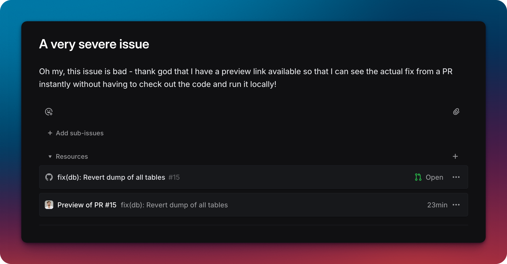
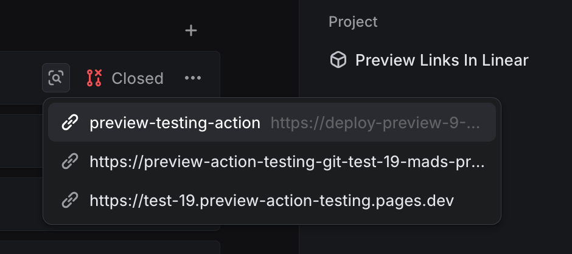

<h1 align="center">GitHub Deployments links in Linear</h1>
<p align="center">Make it easy to access your preview environments in Linear with this GitHub Action.</p>

<div align="center">



</div>

## Wait, doesn't Linear already have this?

[Yes, kinda](https://linear.app/docs/github#pull-request-preview-links) - if a comment or PR description contains a markdown link ending with "preview", Linear will show this nice little icon:



But this action is optimised towards those setups where you don't have a comment-based workflow and use GitHub Deployments directly.

## Usage

```yaml
name: Preview Links in Linear
# Run action when a new comment is added to a pull request and on deployment status changes
on: [issue_comment, deployment_status]

jobs:
    preview-links-in-linear:
        name: Preview Links in Linear
        runs-on: ubuntu-latest
        steps:
            - name: Checkout
              uses: actions/checkout@v4
            - name: Attach preview link to Linear issue
              uses: madsnedergaard/preview-link-in-linear@main
              with:
                  GITHUB_TOKEN: ${{ secrets.GITHUB_TOKEN }}
                  LINEAR_API_KEY: ${{ secrets.LINEAR_API_KEY }}
```

### Configuration

**Linear API key**

Create a new Personal API key here: https://linear.app/{YOUR_ORGANIZATION}/settings/account/security

## How it works

1. The action is triggered when a new comment is added to a pull request (as we are expecting a Linear-bot comment with a link to the Linear issue) or a deployment status changes (we don't know what will come first, so we listen to both)
2. It finds GitHub deployments on the pull request
3. It finds the Linear issue associated with the pull request from the comment
4. It attaches the preview link to the Linear issue 🪄

### Supported providers

The following providers have been tested and verified to work:

- Fly (using [the action in their guide](https://fly.io/docs/blueprints/review-apps-guide/))
- Any custom setup that uses GitHub Deployments

## Contribution

Any feedback or suggestions are welcome, please open an issue or make a PR.
